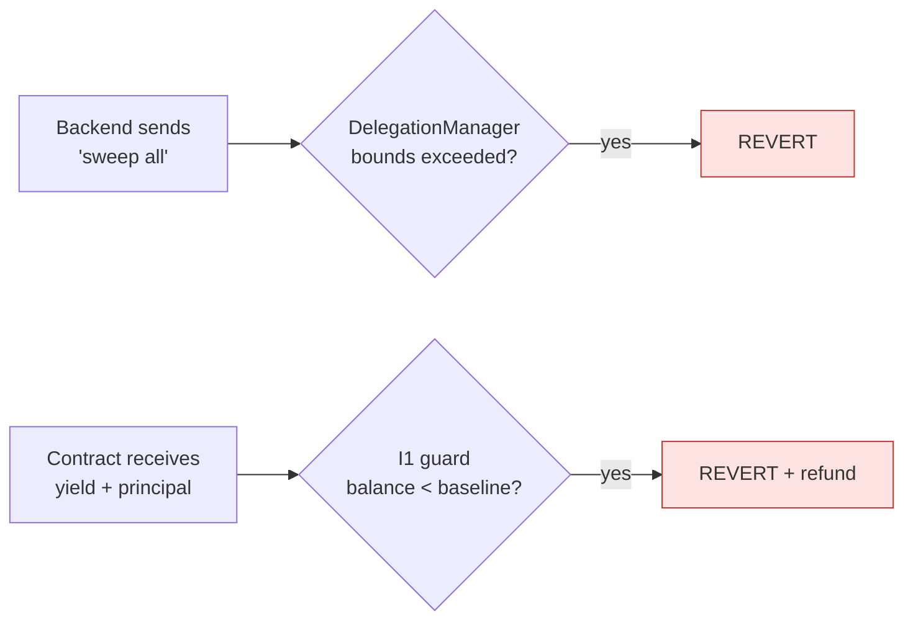
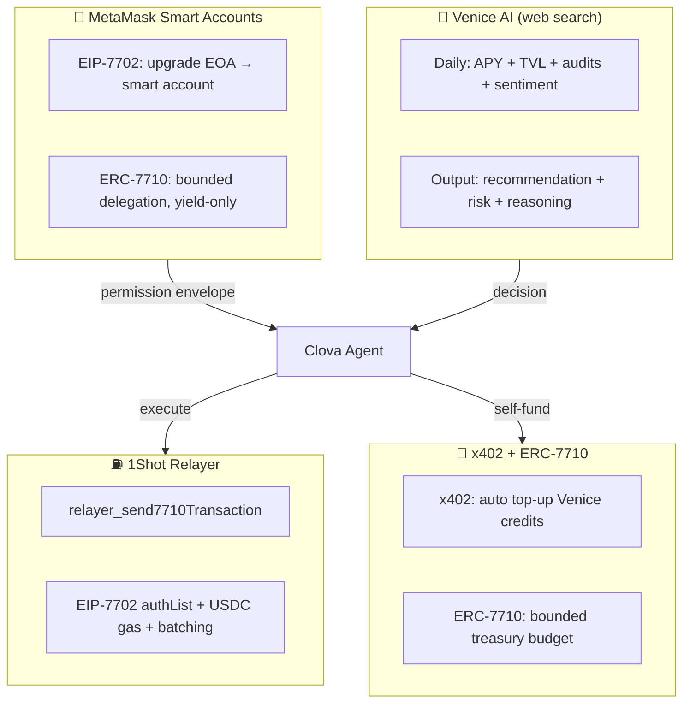

# CLOVA — Documentation

> **No-loss prize-linked savings, autonomously managed by AI. Non-custodial by design. Live on Base.**

---

## The One-Paragraph Pitch

CLOVA lets a group of people earn yield together and compete to win it — without any of them risking their principal. Every user's USDC stays staked inside their own smart account. An AI agent (Venice) monitors protocol health daily using live web search, sweeps only the yield into a shared prize pool, and runs a weekly provably fair draw. Winners take the combined yield. Non-winners keep 100% of their principal. Principal is structurally protected at every layer — the agent's permissions are sealed on-chain by MetaMask's DelegationManager, and the smart contract independently reverts any action that would reduce a user's Aave balance below their recorded principal.

---

## What Makes CLOVA Genuinely Different

### 1. Principal is Architecturally Protected. Not by Policy — by Code.

Most "AI agent + DeFi" projects ask users to trust the agent not to misbehave. CLOVA does the opposite: the agent operates inside a **cryptographically sealed permission envelope** enforced by MetaMask's on-chain DelegationManager. What was not signed cannot be executed through this delegation. The smart contract adds a second independent layer: `depositYield()` reverts if `aTokenBalance < principalBaseline`.

Two enforcement points. Neither controlled by the agent. Neither bypassable through off-chain instructions.



### 2. Venice Judges Protocols, Not Just Measures Them

A simple APY comparator is an if-statement. Venice AI uses **live web search** to read audit reports, governance proposals, liquidity trends, and community sentiment before recommending whether to move funds. It outputs a human-readable explanation every round — shown word-for-word in the AI Transparency Panel.

Example Venice output:
> *"Compound's 6.8% APY is backed by 68% utilization (organic borrowing demand, not incentives expiring next week). TVL stable at $12M. No recent security disclosures. Aave compressed to 5.2% as TVL grew 40% last month. Recommending rotation to Compound."*

This qualitative judgment — considering sustainability, not just spot APY — is what separates a DeFi AI agent from a yield optimizer.

### 3. Atomic Rotation — No Custody Window

Protocol rotation (e.g. Aave → Moonwell) previously required multiple steps: withdraw USDC → hold in agent → deposit to new protocol. During that window, USDC sat in the agent wallet — a brief but real custody moment.

**RotationHelper** eliminates this with atomic execution:
```
Single EVM transaction:
  pull aUSDC from user → Aave withdraw → Moonwell mint → mUSDC back to user
```
If any step fails, the EVM reverts the entire transaction. The user never loses their position.

### 4. The Agent Pays for Itself

The agent earns 10% of swept yield to treasury. When Venice credits run low, the agent automatically tops up via **x402**: treasury wallet signs an ERC-3009 authorization → Venice verifies → credits added. No manual top-up, no USDC lost on failure.

**ERC-7710** bounds all other agent actions: yield sweep and rotation go through user delegations enforced by MetaMask's DelegationManager — verifiable on Basescan.

x402 keeps the agent funded. ERC-7710 keeps the agent bounded. Together they make a self-sustaining, trustless AI agent.

### 5. Proportional Tickets — Economic Anti-Sybil

Tickets are weighted by `principalBaseline[user]`. Splitting $1,000 across 10 wallets gives the same total weight as one wallet with $1,000. **Sybil attacks are economically pointless** — there is no advantage to splitting. No identity verification required.

---

## Four Sponsor Technologies as Load-Bearing Pillars



> Remove any one pillar and the model breaks: without MetaMask the agent is custodial, without Venice it is a blind rule-bot, without 1Shot users need ETH, without x402 the agent needs manual top-ups.

---

## Demo Script (2 Minutes)

**0:00 — Problem (15s)**
"Giving AI access to your crypto is scary. DeFi is complex. Individual yields are too small to be motivating. Clova fixes all three."

**0:15 — Onboarding (20s)**
User connects MetaMask → one EIP-7702 upgrade popup → one ERC-7710 delegation popup (caveats shown in plain language) → deposits USDC. Done.

**0:35 — Dashboard (15s)**
"Principal: $100 intact. Yield accruing. Win probability: 34% (proportional to deposit). Current protocol: Aave."

**0:50 — AI Transparency Panel (20s)**
Venice declined rotation last round because web search found TVL drop on Compound. Full reasoning shown. This is not a black box.

**1:10 — Security Demo (15s)**
Agent tries to sweep principal → smart contract reverts. On-screen. "Technically impossible, not just policy."

**1:25 — x402 + Draw (20s)**
x402 payment log: agent paid 0.001 USDC to Venice. Agent calls requestDraw() → Pyth Entropy → winner selected proportionally → yield distributed.

**1:45 — Close (15s)**
"MetaMask guards permissions. 1Shot handles gas. Venice provides intelligence. x402 makes the agent autonomous. Four technologies, one product."

---

## Live Contracts (Base Mainnet)

| Contract | Address | Basescan |
|---|---|---|
| **ClovaSavingsPool** (proxy) | `0x96246c2d585D423931c00703Fa74589458B6050b` | [View](https://basescan.org/address/0x96246c2d585D423931c00703Fa74589458B6050b) |
| **AaveAdapter** | `0xac8AA12d6E0Fd04D6A9A726A68af0D1109122557` | [View](https://basescan.org/address/0xac8AA12d6E0Fd04D6A9A726A68af0D1109122557) |
| **CompoundAdapter** | `0x727B2c11A70d1C215b7A7455245731694e70AFb9` | [View](https://basescan.org/address/0x727B2c11A70d1C215b7A7455245731694e70AFb9) |
| **MoonwellAdapter** | `0xc7D3b8cda22fcD1B0d3d651326E04C46b2A37ba9` | [View](https://basescan.org/address/0xc7D3b8cda22fcD1B0d3d651326E04C46b2A37ba9) |
| **RotationHelper** | `0xEa448dF1052212F1E7463628F98e836893DD23E2` | [View](https://basescan.org/address/0xEa448dF1052212F1E7463628F98e836893DD23E2) |

---

## Hackathon Track Qualification

| Track | Prize | How CLOVA qualifies |
|---|---|---|
| **Best Agent** | $3,000 | Fully autonomous: daily signal → Venice → guard → 1Shot sweep → weekly draw |
| **Best x402 + ERC-7710** | $3,000 | Real HTTP 402 → on-chain USDC payment to Venice; ERC-7710 delegation for yield sweep |
| **Best Use of Venice** | $3,000 | Venice is the decision-maker every round; full reasoning surfaced in UI |
| **Best Use of 1Shot** | $1,000 | All execution via `relayer_send7710Transaction` with 7702 + USDC gas |

---

## Documentation Index

| Doc | What you'll find |
|---|---|
| [Overview](./overview.md) | Full problem/solution breakdown, round flow, hackathon positioning |
| [Architecture](./architecture.md) | System diagram, component map, data flows |
| [Smart Contracts](./smart-contracts.md) | Contract reference, ABIs, functions, invariants |
| [Delegation](./delegation.md) | ERC-7710 + EIP-7702 — how permissions work end-to-end |
| [AI Agent](./ai-agent.md) | Venice reasoning, signals, guardrails, x402 payments |
| [Security Model](./security.md) | Invariants, threat model, what Clova can and cannot protect |
| [API Reference](./api-reference.md) | All backend endpoints |
| [Deployment](./deployment.md) | How to deploy frontend, backend, and contracts |
| [Phase 2 Roadmap](./phase2.md) | What comes after the hackathon |
