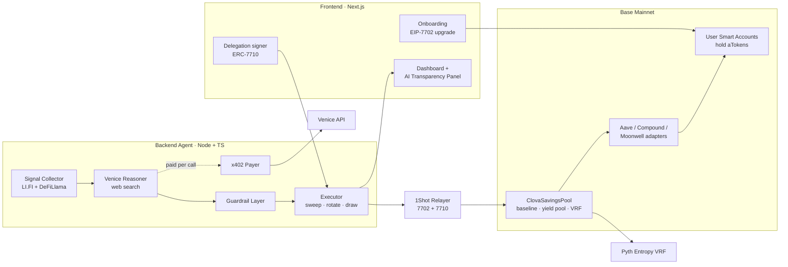
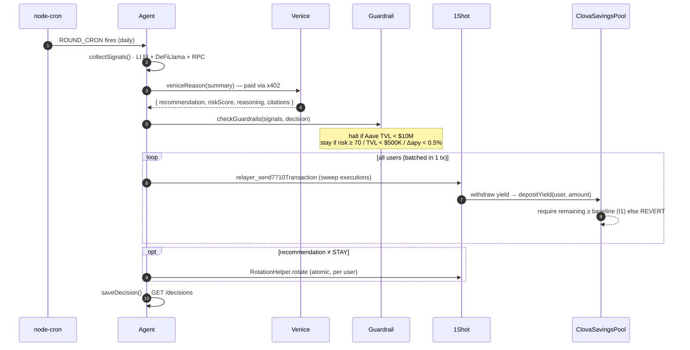
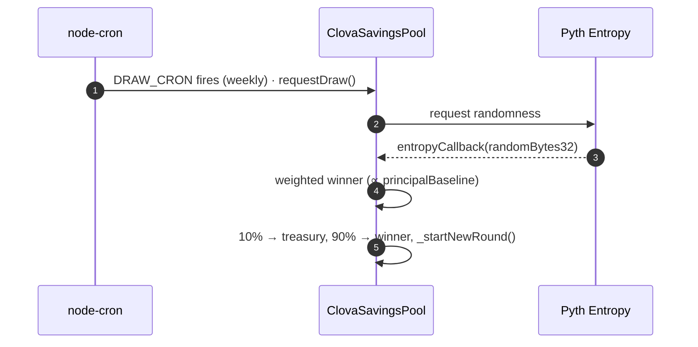
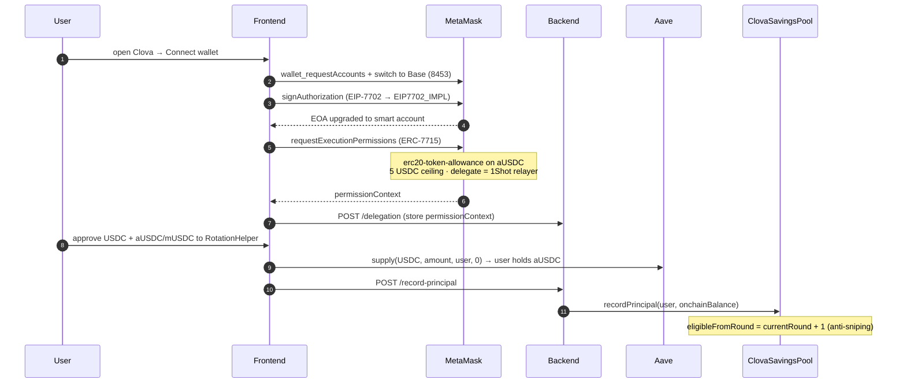

# Architecture

## System Overview

---

## Component Breakdown

### Frontend (Next.js + Wagmi + viem)

| Component | File | Responsibility |
|---|---|---|
| Landing Page | `web-landing.jsx` | Marketing, connect CTA |
| Onboarding Flow | `screens-ob.jsx` | EIP-7702 upgrade → delegation signing → deposit |
| Dashboard | `screens-dash.jsx` | Principal, yield, win%, AI panel, withdraw |
| Wallet Context | `wallet-context.jsx` | All on-chain reads/writes, delegation logic |
| Config | `lib/clova.js` | Addresses, ABIs, chain config from env vars |

**Key flows in wallet-context.jsx:**
- `connectWallet()` → MetaMask connect + chain switch
- `upgradeToSmartAccount()` → EIP-7702 authorization via MetaMask SDK
- `signDelegation()` → ERC-7715 `wallet_grantPermissions` → store in backend
- `deposit()` → approve USDC → Aave supply → record principal
- `withdraw()` → Aave withdraw → sync baseline via backend
- `fetchPoolData()` → multi-call: principal, yield, round state, participants

---

### Backend Agent (Node.js + TypeScript + Express)

| Module | File | Responsibility |
|---|---|---|
| API Server | `api.ts` | REST endpoints, webhooks, admin routes |
| Scheduler | `scheduler.ts` | Daily sweep cycle + weekly draw cycle |
| Signal Collector | `signals.ts` | LI.FI Earn API + DeFiLlama + on-chain utilization |
| Venice AI | `venice.ts` | AI reasoning, web search, auto top-up |
| Guardrail | `guardrail.ts` | Safety checks before executing AI recommendation |
| Executor | `executor.ts` | 1Shot relay calls, batch sweep, protocol rotation |
| x402 Payer | `x402.ts` | HTTP 402 payment flow for Venice API calls |
| Database | `db.ts` | JSON file store: decisions, delegations, txs |
| Config | `config.ts` | Env vars, addresses, ABIs, viem clients |

---

### Smart Contracts (Solidity + Foundry)

| Contract | Responsibility |
|---|---|
| `ClovaSavingsPool.sol` | Main pool: registration, yield sweep, draw, prize distribution. UUPS upgradeable proxy. |
| `AaveAdapter.sol` | Wraps Aave v3 supply/withdraw/valueOf |
| `CompoundAdapter.sol` | Wraps Compound Comet v3 supply/withdraw/valueOf |
| `MoonwellAdapter.sol` | Wraps Moonwell mToken supply/redeemUnderlying/valueOf |
| `RotationHelper.sol` | Atomic protocol rotation: pull aUSDC/mUSDC → swap protocol → return new tokens, 1 tx |

---

## Data Flow: Daily Sweep Cycle

---

## Data Flow: User Onboarding

---

## Cron Schedule

| Cron | Default | Action |
|---|---|---|
| `ROUND_CRON` | `0 0 * * *` (daily midnight) | Venice analysis + yield sweep |
| `DRAW_CRON` | `0 0 * * 0` (Sunday midnight) | Prize draw via Pyth VRF |

Both configurable via env vars. Manual triggers available via `/admin/run-cycle` and `/admin/draw` (deployer wallet signature required).

---

## Storage

Backend uses JSON file storage (`backend/data/`):

| File | Contents |
|---|---|
| `decisions.json` | Venice AI decision log (last 100 rounds) |
| `delegations.json` | User permissionContexts keyed by address |
| `transactions.json` | 1Shot relay transaction log |
| `x402payments.json` | Venice payment receipts |

> Phase 2: migrate to PostgreSQL for production scale.
