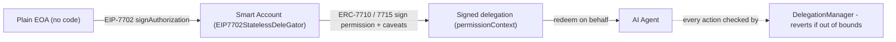
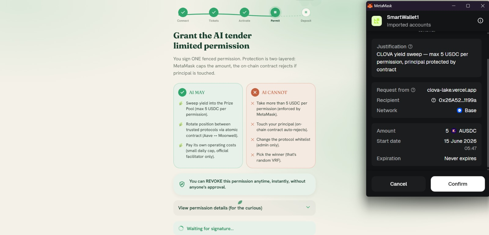
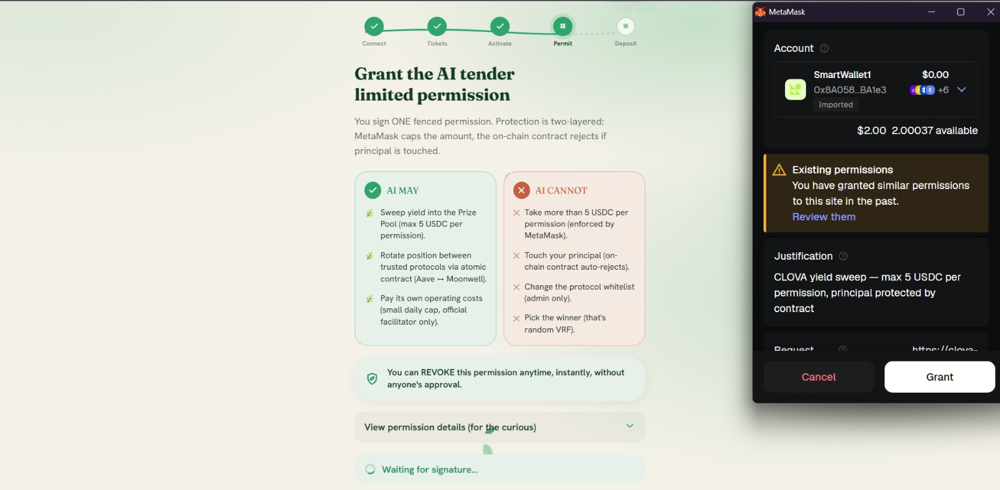
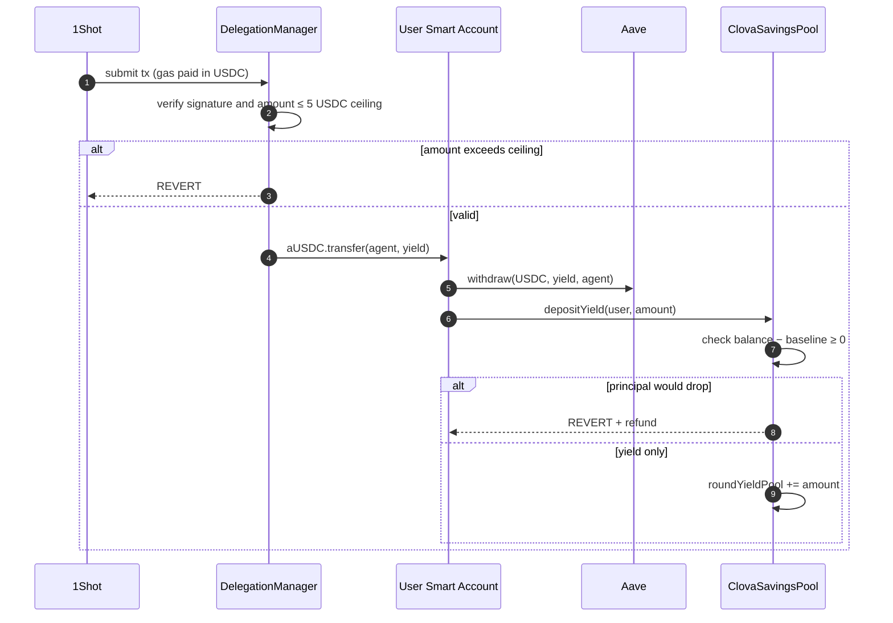
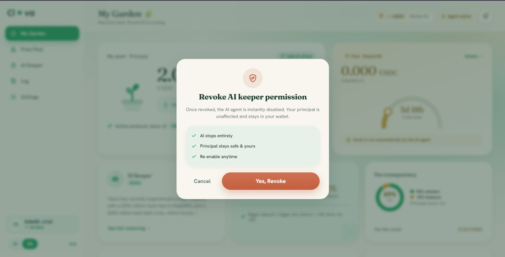
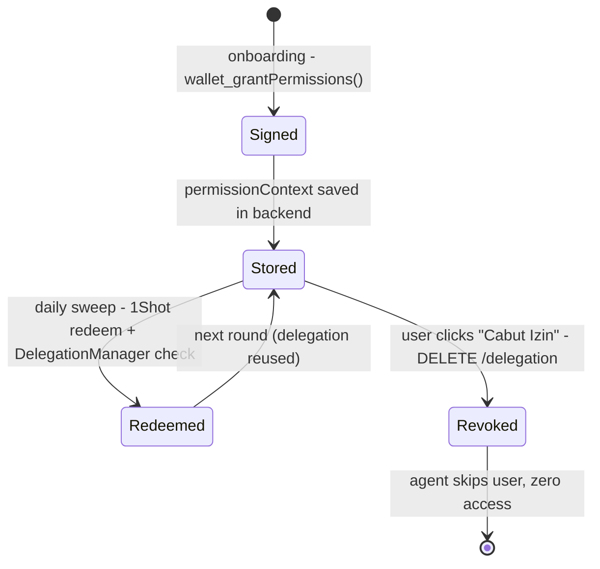

# Delegation — How Clova Uses ERC-7710 + EIP-7702

Delegation is the core primitive that makes Clova non-custodial. This document explains what delegation is, how it works in Clova, the two types used, and the full lifecycle from signing to revocation.

---

## Why Delegation?

Traditional DeFi agents face a dilemma:

- **Custodial:** User sends funds to the agent's wallet → agent acts freely → user trusts the agent not to steal
- **Non-custodial without delegation:** Agent has no access → user must manually approve every action

Clova uses a third option: **bounded delegation**. The user signs a permission that gives the agent exactly the access it needs — no more, no less — enforced by the blockchain itself.

> "Safe not because you trust the AI, but because the code makes it impossible for it to exceed its bounds."

---

## Two Technologies Working Together



### EIP-7702 — Upgrade EOA to Smart Account

An ordinary Ethereum wallet (EOA) cannot enforce delegation logic — it has no code. EIP-7702 solves this by pointing the EOA's code slot to a smart contract implementation (MetaMask's `EIP7702StatelessDeleGator`).

After upgrade:
- The wallet address stays the same
- The wallet gains smart account capabilities (delegation enforcement, batching)
- The user's private key still controls it

```
Before 7702:  0xUserAddress → EOA (no code)
After  7702:  0xUserAddress → EIP7702StatelessDeleGator (smart account logic)
```

### ERC-7710 — Signed Delegation with Caveats

ERC-7710 is the delegation standard used by MetaMask Smart Accounts Kit. A delegation is a signed message that says:

> "I (user) authorize you (agent) to act on my behalf, but only within these specific constraints (caveats)."

The constraints are enforced on-chain by MetaMask's `DelegationManager` contract — not by the agent's own code. If the agent tries to exceed the caveats, the transaction reverts before executing.

---

## Type 1 — User Delegation (Yield Sweep + Protocol Rotation)

This is the main delegation. Every user who joins Clova signs exactly one delegation to the agent.

### What it grants

In the browser, MetaMask issues this delegation through the **ERC-7715** flow (`requestExecutionPermissions`). ERC-7715 supports amount-bounded token permissions — not arbitrary custom caveats — so the user delegation is a single capped allowance:

```typescript
extendedWalletClient.requestExecutionPermissions([{
  chainId: CHAIN_ID,
  to: ONESHOT_TARGET,                    // delegate: the 1Shot relayer
  permission: {
    type: "erc20-token-allowance",       // MetaMask built-in enforcer (amount cap)
    data: {
      tokenAddress: AUSDC_ADDRESS,       // aUSDC (Aave interest-bearing USDC)
      allowanceAmount: parseUnits("5", 6), // 5 USDC ceiling — fixed, regardless of deposit size
      justification: "CLOVA yield sweep — max 5 USDC per permission, principal protected by contract",
    },
    isAdjustmentAllowed: false,
  },
}])
```



### What it grants — and what it does NOT

| The agent CAN | The agent CANNOT |
|---|---|
| Transfer aUSDC up to a **5 USDC** ceiling, via the 1Shot relayer | Move more than 5 USDC per permission (MetaMask enforces the cap) |
| Trigger yield sweeps and rotations | Reduce principal — the pool's `depositYield()` reverts any deposit leaving balance < baseline |
| — | Be used after revocation (one click, instant) |

> **Honest note on scope.** ERC-7715 in the browser only supports *amount-capped* token permissions — it cannot attach a target/method whitelist or a custom yield-only enforcer to the user delegation. The yield-only guarantee therefore lives in **two on-chain layers**: the 5 USDC ceiling (caps blast radius) and the pool's `depositYield()` check (rejects principal-reducing deposits). A future `YieldSweeper` contract (see [Phase 2](./phase2.md)) will enforce the exact `balance − baseline` bound atomically, removing the static ceiling. The custom `YieldOnlyCaveatEnforcer` is already written and tested (20+ tests) for that path.

### How the user signs it (Frontend Flow)



```
1. User clicks "Mulai Nabung" in onboarding
2. Frontend calls wallet_grantPermissions (ERC-7715) via MetaMask SDK
   → MetaMask shows popup: "Clova agent requests the following permissions..."
   → User sees plain-language caveat descriptions
   → User clicks Approve
3. MetaMask returns permissionContext (signed delegation proof)
4. Frontend sends permissionContext to backend: POST /delegation
5. Backend stores it — used every sweep cycle
```

The user never signs a raw transaction for sweep/rotation. They sign **once**, and the delegation covers all future sweep and rotation operations.

---

## Type 2 — Treasury Delegation (x402 Payments)

A separate, more restricted delegation covers the agent's self-funding via x402.

```typescript
// Signed off-line with the treasury private key (not the browser),
// so it can use the toolkit's full createDelegation + signDelegation path.
createDelegation({
  from: TREASURY_ADDRESS,           // delegator: protocol treasury
  to:   AGENT_ADDRESS,              // delegate: AI agent
  scope: {
    type: "Erc20TransferAmount",    // amount-scoped delegation
    tokenAddress: USDC_ADDRESS,     // USDC only
    maxAmount: parseUnits("5", 6),  // 5 USDC cap per signing
  },
})
```

This delegation lets the agent fund its own Venice usage (x402), but:
- Only USDC, amount-capped at **5 USDC per signing** — cannot drain the treasury
- Redeemed by the agent via `DelegationManager.redeemDelegations`
- Exposure is bounded on-chain even if the agent server is fully compromised

---

## How the Agent Redeems a Delegation

When the sweep cycle runs, the agent does not send transactions directly. It **redeems** the user's delegation via 1Shot relayer:

### Step 1 — Build the execution

```typescript
// Example: withdraw yield from Aave to agent
const execution = {
  target:   AAVE_POOL,
  value:    0n,
  callData: encodeFunctionData({
    abi:          aaveAbi,
    functionName: "withdraw",
    args:         [USDC_ADDRESS, yieldAmount, AGENT_ADDRESS],
  }),
};
```

### Step 2 — Wrap in delegation redemption

```typescript
const redeemCalldata = encodeRedeemDelegations({
  delegations: [[signedDelegation]],  // the user's stored permissionContext
  executions:  [[execution]],
});
```

### Step 3 — Send via 1Shot relayer

```typescript
await rpc("relayer_send7710Transaction", [{
  chainId:           "8453",
  authorizationList: [agentEIP7702Auth],  // 7702: agent is smart account
  transactions: [
    {
      permissionContext: userA_delegation,
      executions: [withdrawYieldFromAave_userA],
    },
    {
      permissionContext: userB_delegation,
      executions: [withdrawYieldFromAave_userB],
    },
    // ... all active users in one batch
  ],
  feeToken:        USDC_ADDRESS,
  destinationUrl:  WEBHOOK_URL,
}]);
```

1Shot pays the gas in USDC (deducted from the agent's USDC balance). Users need zero ETH.

### What happens on-chain



The agent's reach is bounded twice: the delegation caps how much aUSDC can move (5 USDC), and the pool's `depositYield()` guard refuses any deposit that would leave the user below their principal. Worst case, a fully compromised agent moves at most 5 USDC of a user's funds.

---

## Protocol-Specific Execution Differences

### Yield Sweep

Different protocols return withdrawn tokens differently during sweep:

| Protocol | Withdraw behavior | Executions needed |
|---|---|---|
| **Aave** | `withdraw(asset, amount, to)` — sends directly to `to` address | 1 execution |
| **Compound** | `withdraw(asset, amount)` — sends to `msg.sender` (user's wallet) | 2 executions: withdraw + `usdc.transfer(agent, amount)` |
| **Moonwell** | `redeemUnderlying(amount)` — sends to `msg.sender` (user's wallet) | 2 executions: redeem + `usdc.transfer(agent, amount)` |

For Compound and Moonwell, the sweep moves the protocol's receipt token (e.g. mUSDC) to the agent within the same 5 USDC allowance ceiling; the agent then redeems it to USDC before depositing. The delegation caps the amount, and the pool's `depositYield()` guard rejects any principal-reducing deposit.

### Protocol Rotation (via RotationHelper — Atomic)

Rotasi antar protokol dilakukan oleh **RotationHelper** — sebuah kontrak helper yang menggabungkan seluruh langkah perpindahan dana menjadi **1 transaksi EVM atomik**. Jika ada langkah yang gagal, seluruh tx di-revert dan user tetap memegang token aslinya.

```
Aave → Moonwell:
  RotationHelper.rotateAaveToMoonwell(user, amount)
    └─ pull aUSDC from user
    └─ aave.withdraw → USDC
    └─ moonwell.mint → mUSDC
    └─ mUSDC.transfer → user

Moonwell → Aave:
  RotationHelper.rotateMoonwellToAave(user, amount)
    └─ pull mUSDC from user
    └─ moonwell.redeemUnderlying → USDC
    └─ aave.supply(onBehalfOf: user) → aUSDC kembali ke user
```

**Prasyarat (sekali saat onboarding):** user harus approve aUSDC dan mUSDC ke alamat RotationHelper. Approval ini dilakukan otomatis di flow deposit. Setelah itu, agent bisa merotasi tanpa interaksi user lebih lanjut.

---

## Revocation

Users can revoke their delegation at any time by clicking **"Cabut Izin"** in the dashboard.



```
1. Frontend calls backend: DELETE /delegation/:userAddress
2. Backend removes stored permissionContext
3. Agent can no longer build a valid redeemDelegation call for this user
4. On next sweep cycle: user is skipped (no delegation found)
```

Revocation is **immediate** — the agent cannot perform any further actions on the user's account. The user's principal remains in Aave and can be withdrawn directly by the user via the dashboard's "Tarik" button (direct transaction, no delegation needed).

---

## Delegation Lifecycle Summary



---

## Why This Matters for the Hackathon

MetaMask Smart Accounts Kit's core value proposition is **permission sharing** — the ability to delegate bounded, revokable, auditable permissions to other agents. Clova is a complete production demonstration of this:

- **Bounded:** caveats limit targets, methods, and amounts — enforced on-chain
- **Auditable:** every delegation is stored and every redemption is a traceable on-chain transaction
- **Revokable:** single click, instant effect
- **Agentic:** the agent autonomously acts within its delegation every day without user interaction

This is not a toy example. The delegation powers real yield sweeps, real protocol rotations, and real prize pool deposits — on Base mainnet.
