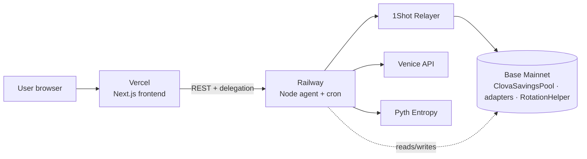

# Deployment Guide

## Architecture



---

## Deployed Contract Addresses (Base Mainnet)

| Contract | Address |
|---|---|
| ClovaSavingsPool (proxy) | `0x96246c2d585D423931c00703Fa74589458B6050b` |
| AaveAdapter | `0xac8AA12d6E0Fd04D6A9A726A68af0D1109122557` |
| CompoundAdapter | `0x727B2c11A70d1C215b7A7455245731694e70AFb9` |
| MoonwellAdapter | `0xc7D3b8cda22fcD1B0d3d651326E04C46b2A37ba9` |
| RotationHelper | `0xEa448dF1052212F1E7463628F98e836893DD23E2` |

---

## Smart Contract Deploy (if redeploying)

```bash
cd smart-contract

# Set env vars
cp .env.example .env
# Fill: PRIVATE_KEY, TREASURY_ADDRESS, AGENT_ADDRESS

# Deploy + verify
source .env && forge script script/Deploy.s.sol \
  --rpc-url $BASE_MAINNET_RPC_URL \
  --private-key $PRIVATE_KEY \
  --broadcast \
  --verify \
  --etherscan-api-key $BASESCAN_API_KEY \
  --slow \
  -vvv
```

Output will show new contract addresses to update in backend/frontend env vars.

---

## Backend Deploy (Railway)

### 1. Install Railway CLI
```bash
npm install -g @railway/cli
railway login
```

### 2. Initialize project
```bash
cd backend
railway init   # Create new project → name: clova-agent
```

### 3. Set environment variables
```bash
railway variables set \
  AGENT_PRIVATE_KEY=0x... \
  POOL_ADDRESS=0x96246c2d585D423931c00703Fa74589458B6050b \
  ADAPTER_ADDRESS=0xac8AA12d6E0Fd04D6A9A726A68af0D1109122557 \
  COMPOUND_ADAPTER_ADDRESS=0x727B2c11A70d1C215b7A7455245731694e70AFb9 \
  MOONWELL_ADAPTER_ADDRESS=0xc7D3b8cda22fcD1B0d3d651326E04C46b2A37ba9 \
  ROTATION_HELPER_ADDRESS=0xEa448dF1052212F1E7463628F98e836893DD23E2 \
  TREASURY_ADDRESS=0x92F9778c18D43b9721E58A7a634cb65eeA80661d \
  DEPLOYER_ADDRESS=0x92F9778c18D43b9721E58A7a634cb65eeA80661d \
  BASE_RPC_URL=https://mainnet.base.org \
  CHAIN_ID=8453 \
  VENICE_API_KEY=... \
  LIFI_API_KEY=... \
  ONESHOT_RPC_URL=https://relayer.1shotapi.com/relayers \
  ONESHOT_API_KEY=... \
  ADMIN_SECRET=... \
  ROUND_CRON="0 0 * * *" \
  DRAW_CRON="0 0 * * 0" \
  PORT=3001
```

### 4. Deploy
```bash
railway up
```

### 5. Get Railway URL and set webhook
```bash
railway domain   # → https://clova-agent-xxx.railway.app

railway variables set \
  WEBHOOK_BASE_URL=https://clova-agent-xxx.railway.app
```

---

## Frontend Deploy (Vercel)

### 1. Set environment variables in Vercel dashboard

| Key | Value |
|---|---|
| `NEXT_PUBLIC_BACKEND_URL` | `https://clova-agent-xxx.railway.app` |
| `NEXT_PUBLIC_POOL_ADDRESS` | `0x96246c2d585D423931c00703Fa74589458B6050b` |
| `NEXT_PUBLIC_ADAPTER_ADDRESS` | `0xac8AA12d6E0Fd04D6A9A726A68af0D1109122557` |
| `NEXT_PUBLIC_ROTATION_HELPER_ADDRESS` | `0xEa448dF1052212F1E7463628F98e836893DD23E2` |
| `NEXT_PUBLIC_USDC_ADDRESS` | `0x833589fCD6eDb6E08f4c7C32D4f71b54bdA02913` |
| `NEXT_PUBLIC_AGENT_ADDRESS` | `0x817E6370fdacA82DEcdD05AD8f464981d05935d3` |
| `NEXT_PUBLIC_CHAIN_ID` | `8453` |
| `NEXT_PUBLIC_DEPLOYER_ADDRESS` | `0x92F9778c18D43b9721E58A7a634cb65eeA80661d` |

### 2. Deploy from GitHub
Connect repo to Vercel → auto-deploy on push to main.

Or manually:
```bash
cd frontend
npx vercel --prod
```

---

## Wallet Funding Requirements

| Wallet | Address | Required |
|---|---|---|
| **Agent** | `0x817E6370fdacA82DEcdD05AD8f464981d05935d3` | 0.001 ETH + 2 USDC |
| **Pool contract** | `0x96246c2d585D423931c00703Fa74589458B6050b` | 0.001 ETH (Pyth fees) |

---

## Manual Trigger (Demo)

### Via curl (from terminal)
```bash
# Sweep (collect yield from all users)
curl -X POST https://clova-agent-xxx.railway.app/admin/run-cycle \
  -H "x-admin-secret: YOUR_ADMIN_SECRET"

# Draw (pick winner via Pyth VRF)
curl -X POST https://clova-agent-xxx.railway.app/admin/draw \
  -H "x-admin-secret: YOUR_ADMIN_SECRET"
```

### Via wallet signature (from frontend admin panel)
Connect with deployer wallet → admin panel appears → click "Trigger Draw" → sign message in MetaMask.

---

## Verify Deployment

```bash
# Check agent is alive
curl https://clova-agent-xxx.railway.app/status

# Check AI decisions are being logged
curl https://clova-agent-xxx.railway.app/decisions

# Check agent wallet balance
curl https://clova-agent-xxx.railway.app/admin/agent-balance \
  -H "x-admin-secret: YOUR_ADMIN_SECRET"

# Test Venice connection
curl -X POST https://clova-agent-xxx.railway.app/admin/test-venice \
  -H "x-admin-secret: YOUR_ADMIN_SECRET"
```
