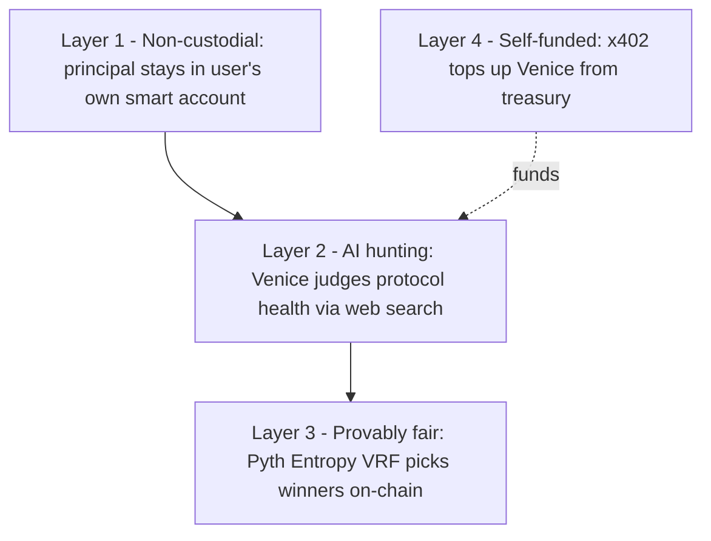
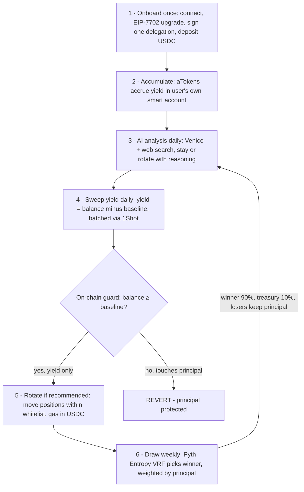

# Overview

## What is Clova?

**Clova** is a no-loss prize-linked savings application on Base, built around one core insight: *an AI agent whose reach is bounded on-chain is more powerful than one you merely trust not to misbehave.*

A group of people deposit USDC. Their principal **never leaves their own smart account**. An AI agent (Venice) monitors DeFi protocols daily using live web search, rotates funds to the healthiest option within strict on-chain bounds, and sweeps accumulated yield into a shared prize pool. Every week, a provably fair draw picks a winner proportional to deposit size. Non-winners keep 100% of their principal. The agent is self-funded via x402 micropayments.

> *"Save, never lose your principal, win the combined yield of everyone — managed by an AI whose access to your funds is capped on-chain and revocable in one click."*

**The key distinction:** CLOVA's security is not a policy or a promise — it is a bounded permission enforced by the EVM. The agent holds a delegation capped at 5 USDC per signing, and the pool contract enforces `aTokenBalance ≥ principalBaseline` before accepting any yield deposit, reverting and refunding otherwise. Even a fully compromised agent can move at most 5 USDC of a user's funds — a fraction of any real deposit — and the user can revoke instantly.

---

## The Problem

### Problem 1 — People Fear Giving AI Access to Their Money

Current AI agent frameworks require users to trust that the AI will not misbehave. There is no standard way to grant an AI agent:
- **Bounded** permissions (capped reach, principal guarded on-chain)
- **Auditable** permissions (logged on-chain)
- **Revokable** permissions (exit anytime, instantly effective)

Without these, users rationally refuse to let AI touch their funds. The result: AI agents in DeFi are either custodial (platform holds your money) or theoretical.

**Clova's answer:** a bounded ERC-7715/7710 delegation plus on-chain contract guards. The agent's permission is not a promise — it is an amount-capped, revocable constraint enforced by MetaMask's DelegationManager and the pool contract.

### Problem 2 — DeFi Yield Management is Complex and Time-Consuming

To optimize yield, a user must:
- Track APY across multiple protocols daily
- Monitor TVL changes, utilization rates, audit news, governance proposals
- Manually move funds when a better or safer option appears
- Pay gas every time they rebalance

Most users don't do this. They deposit once, forget, and miss both better opportunities and early warning signs of protocol risk.

**Clova's answer:** Venice AI does this continuously — not just tracking numbers, but performing qualitative analysis via live web search and explaining every decision in plain language.

### Problem 3 — Individual Yields Are Too Small to Be Motivating

$1,000 at 5% APY = $50/year = $4.16/month. Not compelling enough to change saving behavior.

Prize-linked savings is a proven behavioral economics mechanism: pooling yield creates a lottery effect that dramatically increases saving motivation, even though the expected value is identical.

**Clova's answer:** Pool everyone's yield into a weekly prize. $50,000 in the pool at 5% APY = $2,500/week in prizes. One winner. Everyone else keeps their principal.

### Problem 4 — Prize Pools Require Trust in the Operator

Existing prize savings protocols either:
- Are custodial (operator holds all funds)
- Use off-chain randomness (not verifiable)
- Do not explain why funds moved between protocols
- Have no mechanism preventing operator manipulation of winner selection

**Clova's answer:** Non-custodial (ERC-7710), on-chain verifiable VRF (Pyth Entropy), transparent AI decision log, and mathematical principal protection.

---

## The Solution



### Layer 1 — Non-Custodial Principal Protection (ERC-7710 + EIP-7702)

Users upgrade their EOA to a smart account (EIP-7702) and sign a single bounded delegation. The agent receives exactly one capability:

```
Allowed targets : Aave Pool, Compound Comet, Moonwell mToken, Prize Pool, USDC
Allowed methods : supply, withdraw, transfer
Sweep limit     : current aToken balance − principalBaseline (enforced on-chain)
```

The delegation is enforced by MetaMask's DelegationManager contract — not by the agent's own code. If the agent tries to exceed these bounds, the transaction reverts before it executes. Users can revoke instantly from the dashboard, after which the agent has zero access.

### Layer 2 — AI That Hunts Opportunities, Not Just Monitors Risk

Venice AI is not a simple alert system. It actively evaluates whether there is a **better opportunity** available today:

**Signal collection (daily):**
- APY (spot, 7-day, 30-day average) via LI.FI Earn API (primary) + DeFiLlama (fallback)
- TVL and utilization rates per protocol (on-chain RPC + DeFiLlama)
- Live web search: recent audits, exploit reports, governance proposals, sentiment

**Venice's decision process:**
- Is the current protocol still safe and competitive?
- Is there an alternative with meaningfully better risk-adjusted yield?
- Are there signals (audit concerns, TVL drop, reward expiration) that suggest moving?
- What is the switching cost vs. the expected gain?

**Output:**
```json
{
  "recommendation": "Compound",
  "riskScore": 38,
  "reasoning": "Aave APY has compressed to 4.1% over 30 days as TVL grew. Compound's 6.2% APY is backed by 68% utilization (organic borrowing demand, not temporary incentives). No recent security disclosures. TVL at $12M is adequate for our pool size. Recommending rotation.",
  "citations": ["https://...", "https://..."]
}
```

This reasoning is displayed word-for-word in the AI Transparency Panel. Users see exactly what the AI was thinking.

**Guardrails block the AI when:**
- Risk score ≥ 70/100
- Target TVL < $500K
- APY improvement < 0.5% (not worth switching cost)
- Aave TVL drops below $10M (emergency halt)

### Layer 3 — Provably Fair Winner Selection (Pyth Entropy VRF)

Winner selection is not performed by the AI, the contract owner, or any off-chain randomness. Pyth Entropy generates a **verifiable random number on-chain** — the seed is committed before reveal, and anyone can verify on Basescan that the result was not manipulated.

Winner selection algorithm:
```
totalWeight = sum of principalBaseline for all active participants
winnerPoint  = randomNumber % totalWeight
cumulative   = 0
for each participant (sorted by address):
    cumulative += principalBaseline[participant]
    if cumulative >= winnerPoint → this participant wins
```

**Why proportional tickets?**

Bigger deposits contribute more yield to the prize pool, so they deserve proportionally more chances. This is contribution-weighted fairness — the same mechanism used by Tramplin on Solana.

**Anti-Sybil:** Splitting $1,000 across 10 wallets ($100 each) gives the same total weight as one wallet with $1,000. There is no advantage to splitting — economically, Sybil attacks are pointless.

### Layer 4 — Self-Funded Agent (x402 + ERC-7710)

The agent monitors Venice credit balance after every AI call. When credits run low, it automatically tops up using **x402**:

```
Agent detects low Venice credits
      → POST /api/v1/x402/top-up (no payment)
      ← 402 Payment Required (5 USDC, EIP-155:8453)
Agent signs ERC-3009 TransferWithAuthorization from treasury wallet
      → POST /api/v1/x402/top-up (X-PAYMENT header with signed authorization)
      ← Venice verifies on-chain → executes transfer → credits added
```

The treasury wallet is connected to the Venice account — every top-up is attributed to the correct account automatically. Venice verifies the authorization before executing the transfer, so no USDC is lost if the request fails.

**ERC-7710** handles yield sweep and protocol rotation: every agent action on user funds goes through bounded user delegations enforced by MetaMask's DelegationManager. The agent's reach is capped at 5 USDC per permission, and the pool contract rejects any sweep that would dip into principal.

Together: x402 keeps the agent funded autonomously, ERC-7710 keeps the agent's permissions cryptographically bounded.

---

## Round Flow



> One winner per draw. Everyone else keeps their full principal and can withdraw anytime.

---

## Hackathon Fit

Clova is built specifically for the MetaMask Smart Accounts Kit × 1Shot API × Venice AI Dev Cook-Off. Every sponsor technology is used at the core of the main demo flow — not as an afterthought.

### MetaMask Smart Accounts Kit (ERC-7710 + EIP-7702)
The entire non-custodial security model is built on MetaMask delegation. Without ERC-7710, the agent would need to be custodial. The hackathon's core theme — *permission sharing* — is the foundational primitive of Clova's trust model.

Demo moment: user signs one delegation in MetaMask, agent tries to exceed its bounds → **on-chain revert**.

### Venice AI
Venice is the brain of every round. It is called once per daily cycle, uses web search to gather live intelligence, and its full reasoning is shown to users. Venice is not a backend helper — it makes the central decision the entire protocol depends on.

Demo moment: Venice declines a rotation because web search found an audit concern on Compound → AI Transparency Panel shows the exact reasoning.

### 1Shot API (EIP-7702 + USDC gas)
All user-facing on-chain execution goes through 1Shot. The agent uses 1Shot's `relayer_send7710Transaction` with `authorizationList` (7702) to batch all users' sweep executions into a single transaction, paying gas in USDC.

Demo moment: sweep cycle runs → one 1Shot transaction covers all users → webhook confirms.

### x402 + ERC-7710
**x402**: when Venice credits drop below threshold, agent auto-tops up — treasury wallet signs ERC-3009 authorization, Venice verifies and adds credits. No manual top-up needed, no USDC lost on failure.

**ERC-7710**: all yield sweep and rotation actions go through user delegations enforced by MetaMask's DelegationManager. Agent permissions are cryptographically bounded — no principal can be touched.

Demo moment: backend log shows auto top-up triggered → Venice credits increase → agent continues operating autonomously.

---

## Key Differentiators (Summary)

| Feature | Why it matters |
|---|---|
| **Non-custodial principal** | Users never give up ownership of their money |
| **Bounded delegation (ERC-7710)** | Agent's power is enforced by math, not promises |
| **Atomic rotation (RotationHelper)** | Protocol switches have zero custody window — EVM atomicity |
| **AI judges quality, not just APY** | Venice uses web search to evaluate sustainability, audits, sentiment |
| **Plain-language AI reasoning** | Full transparency — users understand every decision |
| **On-chain VRF (Pyth Entropy)** | Winner selection is publicly verifiable, not trusting operator |
| **Proportional + anti-Sybil tickets** | Fair by contribution, immune to wallet-splitting |
| **Self-funded agent (x402)** | Agent pays for its own intelligence, sustainable by design |
| **Batch execution (1Shot)** | All users swept in one tx — scales without proportional gas cost |

---

## What Comes Next

CLOVA Phase 1 uses a single Venice AI instance. Phase 2 evolves this into a **multi-agent system** where each agent is an expert:

- **Analyst Agents** — one per protocol, runs in parallel, deep-researches just that protocol
- **Strategy Agent** — synthesizes all analyst reports into allocation percentages
- **Risk Agent** — independent portfolio-level safety check before execution
- **Opportunity Agent** — continuously scans for new protocols worth adding
- **Execution Agent** — purely mechanical, builds and submits transactions

With multi-agent allocation, user funds are split across multiple protocols simultaneously:

```
Example — $2,000 total pool:
  Aave:    50% → $1,000  (stability, high TVL)
  Compound: 30% → $600   (higher yield)
  Morpho:  20% → $400   (efficient lending)

Per user (proportional):
  User A ($1,000): $500 Aave + $300 Compound + $200 Morpho
  User B ($200):   $100 Aave + $60  Compound + $40  Morpho
  User C ($800):   $400 Aave + $240 Compound + $160 Morpho
```

This means a single protocol exploit only affects that slice — not the whole pool. See [Phase 2 Roadmap](./phase2.md) for the full plan.
