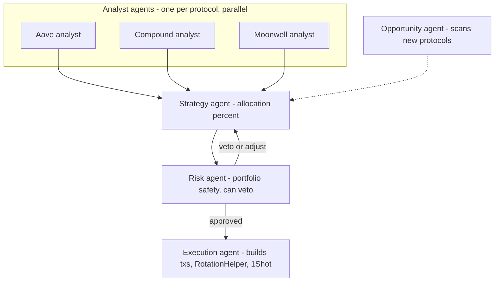

# Phase 2 Roadmap

> Phase 1 (MVP, hackathon) is live. This document describes what CLOVA becomes in production.

---

## Overview

```
Phase 1 (Live)      → 2 protocols (Aave + Moonwell), USDC on Base, proportional tickets,
                       single Venice agent, atomic rotation via RotationHelper,
                       cross-chain deposit via LI.FI (ETH/ARB/POL/BSC → Base)

Phase 2 (Next)      → Multi-agent system, split allocation across 5+ protocols,
                       expanded protocol integrations, intelligent sweep timing,
                       World ID, multi-prize tiers, PostgreSQL

Phase 3 (Future)    → DAO governance, strategy marketplace, multi-chain, mobile app
```

---

## The Big Vision: From One Agent to a Multi-Agent System

In Phase 1, one Venice AI instance does everything: analyze, decide, and supervise execution. This works for an MVP but limits depth.

**Phase 2 introduces a specialized multi-agent architecture** where each agent is an expert at one job:



### Agent Roles

**Analyst Agents (one per protocol)**
Each protocol gets a dedicated Venice AI agent that deeply researches just that one protocol:
- APY trends (spot, 7d, 30d), TVL history, utilization rate
- Web search: recent audits, governance votes, exploit reports, liquidity news
- Output: `{ protocol, apy, tvl, utilization, riskScore, summary }`

Running in parallel — all protocols analyzed simultaneously, not sequentially.

**Strategy Agent**
Receives all analyst reports and answers: *"Given these options, how should we allocate?"*
- Weighs yield vs. risk vs. diversification benefit
- Considers switching costs (gas, slippage)
- Outputs allocation percentages: `{ Aave: 50, Compound: 30, Morpho: 20 }`

**Risk Agent**
Independent second opinion on the strategy proposal:
- Validates no single protocol exceeds safe concentration (e.g. max 60% any one protocol)
- Checks portfolio-level risk (correlated protocols, same underlying risk)
- Can veto or adjust the strategy before execution

**Opportunity Agent**
Continuously scans for new protocols worth adding to the whitelist:
- Monitors APY opportunities outside current whitelist
- Checks protocol age, TVL maturity, audit history
- Surfaces candidates for admin review — cannot add itself

**Execution Agent**
Purely mechanical — takes approved allocation and builds transactions:
- Calculates per-user rebalancing amounts
- Calls RotationHelper for atomic moves
- Batches via 1Shot
- Reports success/failure per user

---

## Phase 2 Features

### 2.1 — Multi-Protocol Allocation (Split %)

**Current:** 100% of funds in one protocol at a time (e.g. all on Aave).

**Phase 2:** Multi-agent system allocates user funds across multiple protocols simultaneously.

#### Concrete Example

```
Pool state:
  User A: $1,000 USDC deposited
  User B: $200  USDC deposited
  User C: $800  USDC deposited
  ─────────────────────────────
  Total:  $2,000 USDC

Multi-agent allocation decision:
  Aave:    50% → $1,000 USDC (stable, high TVL, baseline safety)
  Compound: 30% → $600  USDC (higher yield, healthy utilization)
  Morpho:  20% → $400  USDC (efficient lending, growing TVL)

Per user result (proportional to their deposit):
  User A ($1,000): $500 Aave + $300 Compound + $200 Morpho
  User B ($200):   $100 Aave + $60  Compound + $40  Morpho
  User C ($800):   $400 Aave + $240 Compound + $160 Morpho
```

**Why this matters:**
- A single protocol exploit only affects that allocation slice — not the whole pool
- Different protocols peak at different times; diversification smooths yield
- Risk Agent can enforce hard limits (e.g. max 60% any one protocol)

**What needs to be built:**
- `ClovaSavingsPool`: `principalBaseline` becomes a mapping per protocol per user
- New `AllocationManager.sol`: tracks target allocations, executes rebalancing
- `executor.ts`: build multi-protocol RotationHelper calls per user
- Venice Strategy Agent prompt: output `{"allocations": {"Aave": 50, "Compound": 30, "Morpho": 20}}`
- Dashboard: allocation pie chart per user, yield contribution per protocol

---

---

### 2.2 — Expanded Protocol Integrations

**Current:** Aave v3 (Base) + Moonwell (Base). Two protocols.

**Phase 2+:** Integrate every major yield protocol on Base and expand to other chains.

#### Target Protocol List

| Protocol | Chain | Type | Why |
|---|---|---|---|
| **Aave v3** | Base ✅ | Lending | Live, highest TVL, baseline |
| **Moonwell** | Base ✅ | Lending | Live, native Base |
| **Compound v3** | Base | Lending | Adapter built, integration in progress |
| **Morpho** | Base | Optimized lending | Higher yields, growing TVL |
| **Seamless Protocol** | Base | Lending | Native Base, isolated markets |
| **Fluid** | Base | Lending | Innovative liquidity layers |
| **Yearn v3** | Base | Yield vault | Strategy abstraction |
| **Spark** | Base | Lending | MakerDAO spin-off, sDAI yield |
| **Euler v2** | Base | Modular lending | Risk-isolated vaults |
| **Pendle** | Base | Yield trading | Fixed-rate yield strategies |

Each protocol gets:
1. A dedicated `IYieldAdapter` implementation
2. An Analyst Agent that specializes in that protocol
3. RotationHelper support for atomic moves

#### Opportunity Agent — Protocol Discovery

Rather than manually finding new protocols, the **Opportunity Agent** continuously monitors the DeFi ecosystem:

```
Weekly scan:
  → Search for new protocols deployed on Base with TVL > $5M
  → Check: age > 3 months, audit status, governance maturity
  → Compare yield potential vs. existing whitelist
  → Generate report: "Candidate: Fluid Protocol — $12M TVL, audited by Trail of Bits,
     currently 7.2% APY on USDC, 3 months live, governance multisig"

Result: flagged for admin review — Opportunity Agent cannot add to whitelist itself.
Admin approves → new adapter deployed → Analyst Agent created for it
```

**Why this matters:** The whitelist grows organically as the DeFi ecosystem grows. CLOVA never needs a manual protocol addition — the Opportunity Agent surfaces candidates continuously.

---

### 2.4 — World ID Anti-Sybil (On-Chain)

**Current:** Anti-Sybil is economic (proportional deposits). 1 person with 10 wallets = same weight as 1 wallet.

**Phase 2:** Add World ID verification for users who want a **"human bonus multiplier"** on their tickets:

```
Unverified user: tickets = principalBaseline (as today)
World ID verified: tickets = principalBaseline × 1.2 (20% bonus)
```

**Why:** Incentivizes real humans to verify without blocking unverified users. Creates a network effect for privacy-preserving identity.

**Implementation:**
```solidity
// In register():
IWorldID(WORLD_ID_ROUTER).verifyProof(
    root, groupId, signal, nullifierHash, externalNullifier, proof
);
nullifiers[nullifierHash] = true;  // prevent double-registration
```

**Frontend:** Add World ID verification step to onboarding (optional, after deposit).

---

### 2.5 — Cross-Chain Deposits via LI.FI ✅ IMPLEMENTED

> Shipped in Phase 1. Users on any major chain can deposit into Clova without manually bridging first.

#### Supported chains

| Chain | Token | Chain ID |
|---|---|---|
| **Base** | USDC | 8453 (native — no bridge) |
| Ethereum | USDC | 1 |
| Arbitrum | USDC | 42161 |
| Polygon | USDC | 137 |
| BSC | BNB (native) | 56 |

#### User flow

```
┌─────────────────────────────────────────────────────────────────────┐
│  Deposit Modal                                                       │
│                                                                      │
│  [🔵 Base] [⚪ ETH] [🔷 ARB] [🟣 POL] [🟡 BSC]  ← chain tabs      │
│                                                                      │
│  If Base selected:                                                   │
│    ┌──────────────────────────────────────────┐                     │
│    │  100 USDC  [10] [50] [100] [Max]         │                     │
│    │  Balance: 245.00 USDC                    │                     │
│    └──────────────────────────────────────────┘                     │
│    [Cancel]  [Deposit ▶]                                            │
│                                                                      │
│  If ETH/ARB/POL/BSC selected:                                       │
│    Info: "Your USDC/BNB will be bridged to Base USDC via LI.FI"    │
│    ┌──────────────────────────────────────────┐                     │
│    │  50 USDC  [10] [50] [100]               │                     │
│    │  ─────────────────────────────────────  │                     │
│    │  You receive (est.)  ~49.73 USDC         │                     │
│    │  Bridge fee          ~$0.27              │                     │
│    │  Via                 Stargate            │                     │
│    │  Est. time           5–15 min            │                     │
│    └──────────────────────────────────────────┘                     │
│    [Cancel]  [Bridge & Deposit ▶]                                   │
└─────────────────────────────────────────────────────────────────────┘
```

#### Execution steps (cross-chain)

```
1. APPROVE   ERC-20 approval for LI.FI router (skip for native BNB)
             MetaMask signs approve(spender, MAX_UINT256)

2. BRIDGE    Send LI.FI bridge transaction via MetaMask
             (user is on source chain — MetaMask switches automatically)

3. POLLING   Frontend polls LI.FI getStatus() every 12s
             Status: PENDING → RECEIVING → DONE

4. DEPOSIT   Bridge done. Frontend calls wallet.deposit(receivedAmount):
               a. Switch MetaMask to Base
               b. Approve USDC → Aave Pool
               c. supply(USDC, amount, userAddress, 0) on Aave v3 Base
               d. register(userAddress, "0x") on ClovaSavingsPool
               e. POST /record-principal to backend

5. ORIGIN    POST /record-origin saves originChainId + originToken
             Used later for reverse withdrawal (Phase 2)
```

#### Key files

| File | Role |
|---|---|
| `src/lib/lifi.js` | LI.FI SDK v4 wrapper — `fetchLifiQuote`, `ensureApproval`, `sendBridgeTx`, `pollBridgeStatus` |
| `src/components/web-screens.jsx` → `WebModalDeposit` | Chain selector UI + cross-chain flow |
| `backend/src/db.ts` | `saveOrigin` / `getOrigin` — persist origin chain per user |
| `backend/src/api.ts` | `POST /record-origin`, `GET /origin/:address` |
| `backend/data/origins.json` | Storage: `{ userAddress, originChainId, originChainName, originToken, originSymbol, savedAt }` |

#### LI.FI SDK usage (v4 pattern)

```typescript
import { createClient, getQuote, getStatus } from "@lifi/sdk";

const client = createClient({ integrator: "clova", apiKey: process.env.NEXT_PUBLIC_LIFI_API_KEY });

// Get best bridge route
const quote = await getQuote(client, {
  fromChain:   42161,         // Arbitrum
  toChain:     8453,          // Base
  fromToken:   "0xaf88d065…", // USDC Arbitrum
  toToken:     "0x833589fC…", // USDC Base
  fromAmount:  "50000000",    // 50 USDC (6 decimals)
  fromAddress: userAddress,
  slippage:    0.005,
});

// quote.transactionRequest → send via MetaMask
// quote.estimate.toAmount  → expected USDC on Base
// quote.estimate.feeCosts  → breakdown of bridge fees
// quote.tool               → bridge name (Stargate, Across, etc.)

// Poll status after tx sent
const status = await getStatus(client, {
  txHash,
  bridge:    quote.tool,
  fromChain: 42161,
  toChain:   8453,
});
// status.status → "PENDING" | "DONE" | "FAILED"
```

#### Fee transparency

The deposit modal shows before user confirms:
- **You receive (est.):** `quote.estimate.toAmount / 1e6` USDC
- **Bridge fee:** sum of `quote.estimate.feeCosts[].amountUSD`
- **Via:** `quote.toolDetails.name` (e.g. Stargate, Across, Hop)
- **Est. time:** always shown as 5–15 min (conservative)

Principal recorded is the **actual received amount** on Base (balance diff after bridge), not the quoted amount — protects against slippage.

---

### 2.3b — Reverse Withdrawal (Return to Origin Chain)

> **Status: Phase 2.** The groundwork is in place — `originChain` is already stored per user. Only the withdrawal UI and reverse LI.FI quote need to be built.

**The problem:** A user who deposited BNB from BSC currently receives USDC on Base when they withdraw. They'd have to bridge back manually.

**The solution:** When a user withdraws, if their `originChain ≠ Base`, show a toggle:

```
┌─────────────────────────────────────────────────────┐
│  Withdraw                                           │
│                                                     │
│  Amount: 1.02 USDC                                  │
│                                                     │
│  ○ Receive as USDC on Base  (instant, no fee)       │
│  ● Return as BNB on BSC     (bridge fee: ~$0.30,    │
│                               est. ~0.004 BNB, 5min)│
│                                                     │
│  [Cancel]  [Withdraw ▶]                             │
└─────────────────────────────────────────────────────┘
```

**Important caveats to show the user:**
- Token price may have changed — show USD value, not just token amount
- Two bridge fees total (deposit + withdrawal) — show cumulative cost
- "Return to origin" is opt-in, never forced

**What needs to be built:**

```typescript
// In lifi.js — new helper
export async function fetchReverseQuote(toChainId, toToken, toTokenDecimals, usdcAmountHuman, userAddress) {
  return getQuote(client, {
    fromChain:   8453,        // Base
    toChain:     toChainId,   // e.g. 56 (BSC)
    fromToken:   BASE_USDC,
    toToken,                  // e.g. native BNB
    fromAmount:  parseUnits(String(usdcAmountHuman), 6).toString(),
    fromAddress: userAddress,
    toAddress:   userAddress,
    slippage:    0.005,
  });
}
```

**Files to change:**
- `web-screens.jsx` → `WebModalTarik`: fetch `GET /origin/:address`, show toggle if non-Base
- `src/lib/lifi.js`: add `fetchReverseQuote`
- Withdrawal flow: if reverse selected → Aave withdraw → LI.FI bridge back to origin chain

---

### 2.4 — PostgreSQL Database

**Current:** JSON file storage (`data/*.json`) — works for demo, not production.

**Phase 2:** Migrate to PostgreSQL (Railway add-on):

| Table | Replaces |
|---|---|
| `decisions` | `data/decisions.json` |
| `delegations` | `data/delegations.json` |
| `transactions` | `data/transactions.json` |
| `x402_payments` | `data/x402payments.json` |

**Benefits:**
- Concurrent reads/writes safe
- Historical queries (e.g., "show all rounds where Compound was recommended")
- Backup and recovery
- Can scale to thousands of users

---

### 2.5 — Batch depositYield in Smart Contract

**Current:** After batch 1Shot sweep, agent calls `pool.depositYield(user, amount)` individually for each user (N on-chain transactions).

**Phase 2:** Add `batchDepositYield(address[] users, uint256[] amounts)` to the contract:

```solidity
function batchDepositYield(
    address[] calldata users,
    uint256[] calldata amounts
) external onlyRole(AGENT_ROLE) nonReentrant {
    uint256 total = 0;
    for (uint256 i = 0; i < amounts.length; i++) total += amounts[i];
    usdc.safeTransferFrom(msg.sender, address(this), total);

    for (uint256 i = 0; i < users.length; i++) {
        // I1 check per user
        uint256 remaining = yieldAdapter.valueOf(users[i]);
        if (remaining < principalBaseline[users[i]]) continue; // skip, don't revert
        roundYieldPool += amounts[i];
        emit YieldSwept(users[i], amounts[i], currentRound);
    }
}
```

**Result:** Entire sweep = 2 txs total (1 1Shot batch + 1 approve + 1 batchDepositYield), regardless of user count.

---

### 2.6 — Multiple Prize Tiers

**Current:** Single winner takes 90% of prize pool.

**Phase 2:** Multiple tiers:

```
1st place:  50% of pool
2nd place:  30% of pool
3rd place:  15% of pool
Treasury:    5% of pool
```

**Implementation:**
- `entropyCallback`: run 3 separate weighted random selections (different offsets of same random seed)
- Dedup: if same address selected twice, fall back to next candidate
- `distributePrize(address[] winners, uint256[] amounts)`

**User benefit:** More people win per round → better engagement → more deposits.

---

### 2.7 — Automated Emergency Exit

**Current:** On emergency (Aave TVL crash), agent halts. Users must manually withdraw from Aave.

**Phase 2:** On emergency, agent triggers auto-withdraw for all users:

```typescript
if (guardrail.emergency) {
    // Notify all users via on-chain event
    await pool.declareEmergency();  // emits EmergencyDeclared

    // For each user with delegation: withdraw from protocol → back to user wallet
    for (const user of participants) {
        await executeEmergencyWithdraw(user, delegation);
    }
}
```

**Requires:** New caveat allowing `withdraw → user's own address` (not just to agent). Frontend adds "Emergency: your funds are being returned" notification.

---

### 2.8 — Round History & Analytics

**Current:** Dashboard shows current round only.

**Phase 2:** Full history:
- Past winners per round
- APY achieved vs. market rate comparison
- Total yield generated by the pool
- User's personal history: rounds participated, prize won

**Frontend:** `/history` page with charts (Recharts or Chart.js).

**Backend:** `GET /rounds` endpoint returning historical round data from PostgreSQL.

---

### 2.9 — Mobile App (PWA)

**Current:** Responsive web app.

**Phase 2:** Progressive Web App with push notifications:
- "Round ends in 2 hours"
- "You won! 12.5 USDC claimed"
- "AI rotated to Compound — tap to see why"

MetaMask Mobile deep links for wallet actions.

---

### 2.10 — DAO Governance (Phase 3)

Long-term: protocol parameters governed by stakers:
- Platform fee (currently fixed at 10%)
- Whitelist protocol additions/removals
- Prize tier distribution
- Emergency threshold levels

Governance token: earned by participating in the pool (not pre-mined, not sold).

---

### 2.11 — Venice-Driven Sweep (Intelligent Sweep Timing)

**Current:** Sweep is scheduled by a cron timer (e.g. daily) — regardless of whether accumulated yield is large enough to justify the gas cost.

**Phase 2:** Sweep is triggered by Venice AI based on actual per-user yield data, not a fixed timer.

#### Architecture

```
Lightweight polling scheduler (e.g. hourly)
    │
    ├─▶ Per-user sub-agent: read yieldAdapter.valueOf(user) − principalBaseline[user]
    │       → collect: { user, pendingYield, pendingUsd, protocol, apy }
    │
    ├─▶ Send summary to Venice AI:
    │       "Pool has 5 users. Total pending yield: $4.82.
    │        Largest: $2.10, smallest: $0.08.
    │        Active APY: 5.2%. Estimated 1Shot gas: $0.15.
    │        Is sweeping now worth it?"
    │
    └─▶ Venice decides:
            SWEEP_NOW   → total yield > threshold & gas cost < % of yield
            WAIT        → yield too small, gas not justified
            SWEEP_LARGE → sweep only users with yield > X (skip small ones)
```

#### Example Venice output

```json
{
  "decision": "SWEEP_LARGE",
  "minYieldThresholdUsd": 0.50,
  "reasoning": "Total yield $4.82 but spread across 5 users. 3 users above $0.50 — sweeping them now nets $3.75 after $0.15 gas. The remaining 2 users ($0.08, $0.12) are more efficient to defer 2–3 days.",
  "usersToSweep": ["0xAAA...", "0xBBB...", "0xCCC..."]
}
```

#### Comparison

| Approach | Problem | Venice-Driven |
|---|---|---|
| Daily cron | Sweeps when yield is $0.02 — gas wasted | Sweeps only when economically justified |
| Daily cron | All users swept even when some have negligible yield | Selective per-user sweep |
| Daily cron | Not adaptive to gas price or APY conditions | Venice calculates real-time efficiency |

#### What needs to be built

- `scheduler.ts`: replace `cron.schedule` with lightweight polling + "ask Venice first" logic
- `venice.ts`: add dedicated sweep decision prompt (separate from rotation prompt)
- `executor.ts`: support `sweepYieldBatch(selectedUsers)` — already capable, just needs subset pass-through
- Backend: persist `lastSweepDecision` in decisions log for transparency

---

## Phase 2 Priority Order

| Priority | Feature | Effort | Impact |
|---|---|---|---|
| ✅ | 2 protocols live (Aave + Moonwell) | Done | Foundation |
| ✅ | Cross-chain deposits (LI.FI) | Done | High (accessibility) |
| ✅ | UUPS upgradeable proxy | Done | High (upgrade path) |
| ✅ | Atomic rotation (RotationHelper) | Done | High (no custody window) |
| P0 | PostgreSQL migration | Medium | High (production readiness) |
| P0 | batchDepositYield contract | Low | High (gas efficiency) |
| P0 | Venice-driven sweep timing (§2.11) | Medium | High (AI-native, gas efficient) |
| P1 | **Multi-agent system** (§Big Vision) | High | Very High (core differentiation) |
| P1 | **Multi-protocol allocation** (§2.1) | High | Very High (risk diversification) |
| P1 | **Expanded protocol integrations** (§2.2) | Medium per protocol | High (more yield options) |
| P2 | Opportunity Agent — protocol discovery | Medium | High (self-growing whitelist) |
| P2 | Reverse withdrawal to origin chain | Medium | Medium (UX completeness) |
| P2 | Multiple prize tiers | Medium | Medium (engagement) |
| P2 | World ID integration | Medium | Medium (anti-Sybil bonus) |
| P3 | Automated emergency exit | High | High (trust) |
| P3 | Round history & analytics | Medium | Medium (transparency) |
| P4 | Mobile PWA | High | Medium |
| P5 | DAO governance | Very High | High (decentralization) |

---

## Technical Debt (Post-Hackathon)

| Item | Current State | Fix |
|---|---|---|
| File-based DB | `data/*.json` race conditions under load | Migrate to PostgreSQL |
| `participants[]` array never shrinks | Inactive users iterated in draw | Add `removeParticipant()` or lazy cleanup |
| EIP-7702 re-auth on every sweep | Performance overhead | Cache signed authorization with nonce tracking |
| No retry logic for failed sweeps | Yield stays in Aave, not lost | Add sweep retry queue |
| Venice API single point of failure | If Venice down, round skipped | Fallback to rules-based allocation |
| ~~No contract upgrade path~~ | ✅ Resolved — ClovaSavingsPool deployed as UUPS proxy (ERC1967) | — |
| Cron-based sweep timer | Sweep scheduled without considering gas efficiency vs. yield size | Replace with Venice-driven sweep (§2.11) |
